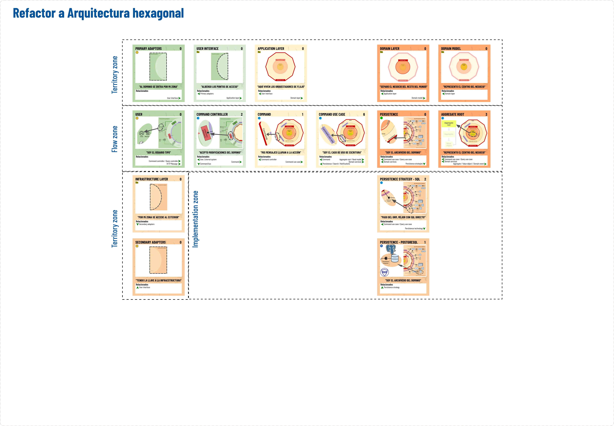

# Learn DDD Step by Step, Using "The DDD Universe" Cards

## Refactor to "Hexagonal Architecture"

As we argue in [our presentation](../../README.md), our goal is to adapt the existing code to make it more flexible to changes.

The first thing we need to do is prepare the ground for DDD to thrive. To do this, it is necessary to refactor our code to place all the pieces where they are expected in a Hexagonal Architecture.

As a guide, we will use the cards from "The DDD Universe." We will reveal cards, read their descriptions, and move code to its expected place. We will encounter several possible options.

- Move classes to a structure specific to Hexagonal Architecture
- Create new classes to accommodate code portions.
- Create new classes and code that currently do not exist

## Starting Point

### Dynamics

We will show attendees a brief presentation talking about the benefits of DDD and its objective.

Next, we will give them access to the repository and explain the key points.

- It's flat code
- Simulates a framework
- There are controller-level tests to ensure that nothing breaks

### [Canva Activity](https://www.canva.com/design/DAF6VDIfdkE/jBve6kYf6zX9ly9tyEToNA/edit?utm_content=DAF6VDIfdkE&utm_campaign=designshare&utm_medium=link2&utm_source=sharebutton)

- To begin, we assume that the layers are those in the drawing and their distribution. We will ask them to mimic that figure with their cards, leaving the cards uncovered.
- We will ask attendees to think about the next card, and we will uncover them in order.
- With each revealed card, we will ask attendees to adapt the code to meet the requirements of the cards that appear.

## Midpoint Inflection (Use Case)

  
<b>Click to expand</b>

### Dynamics

- We must stop here to discuss the responsibilities of the use case (Look for information in books).
- Link to the website to see in detail the explanation of the use case

## Final Solution

  
<b>Click to expand</b>

## Activity: Tarjetas de responsabilidades

  
<b>Click to expand</b>

## Final solution: Tarjetas de responsabilidades

  
<b>Click to expand</b>

