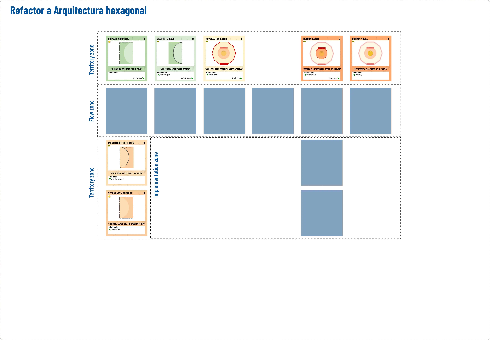
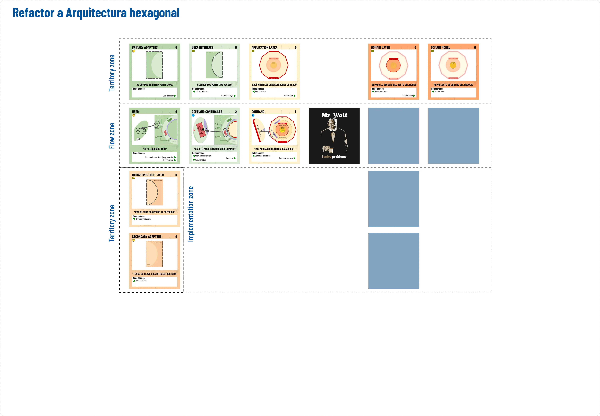

# Aprende DDD paso a paso, usando las cartas de "The DDD universe"

## Refactor a "Arquitectura hexagonal"

#### [Presentación del workshop](https://docs.google.com/presentation/d/17RkrZKJLPwlBhgMuD4ze4J0B2rVFChJ4Po-1e-lSJBU/edit?usp=sharing)

Como argumentamos en [nuestra presentación del código a refactorizar](../../README.es.md), nuestro objetivo es adaptar el código ya existente para hacerlo más flexible a cambios.

Lo primero que necesitamos es abonar el terreno para que DDD pueda prosperar. Para ello, es necesario refactorizar nuestro código para ubicar todas las piezas en el lugar que se espera en una Arquitectura hexagonal.

Como guía, usaremos las cartas de ["The DDD universe"](https://www.theddduniverse.com/). Iremos descubriendo cartas, leyendo su descripción e iremos moviendo código a su lugar esperado. Nos toparemos con varias posibles opciones.

- Mover clases a una estructura propia de Arquitectura hexagonal
- Crear clases nuevas para acomodar las porciones de código.
- Crear clases nuevas y código que actualmente no existe

## Punto de partida

### Dinámica

Mostraremos a los asistentes una pequeña presentación hablando de los beneficios de DDD y su objetivo.

Acto seguido, les daremos acceso al repositorio y les explicamos los puntos clave.

- Es código plano
- Simula un framework
- Hay tests a nivel de controlador para asegurar que no rompemos nada

### [Actividad en Canva](https://www.canva.com/design/DAF6VDIfdkE/jBve6kYf6zX9ly9tyEToNA/edit?utm_content=DAF6VDIfdkE&utm_campaign=designshare&utm_medium=link2&utm_source=sharebutton)

- Para empezar, damos por sentado que las capas son las del dibujo y su distribución. Les pediremos que imiten con sus cartas esa figura. Dejando sin colocar las cartas tapadas.
- Iremos pidiendo a los asistentes que vayan pensando la carta siguiente y las iremos destapando en orden.
- A cada carta destapada, pediremos a los asistentes que adapten el código para cumplir con las cartas que vayan apareciendo.

## Punto intermedio de inflexión (El caso de uso)

  
<b>Click para expandir</b>

### Dinámica

- Nos debemos parar aquí para hablar de las responsabilidades del caso de uso (Buscar info en libros).
- Link a la web para ver con detalle la explicación del caso de uso

## Solución final

  
<b>Click para expandir</b>

### Dinámica

- Abrimos debate sobre la importancia de hacer que un command no devuelva información.
- Refactorizamos código para cumplir expectativas

